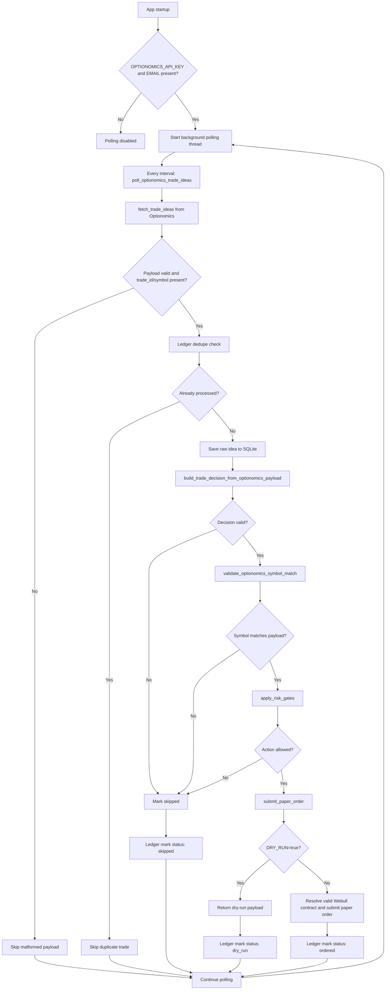

# Ops Paper Trade

This project is a paper-trading automation loop that consumes Optionomics trade ideas, validates them against a deterministic risk model, and then prepares or submits a paper order through Webull. It is designed to run as a polling service rather than an external listener.

The core entry point is [app/main.py](app/main.py). It manages configuration, fetches trade ideas, performs decision logic, stores state in SQLite, and starts the polling background worker.

## What this project does

- polls the Optionomics trade-idea API on a timer
- validates and normalizes incoming trade-idea payloads
- chooses a trading action such as buy, sell short, or skip
- enforces risk gates like symbol consistency, price-level sanity, and max notional caps
- deduplicates by trade ID to avoid repeat submissions
- resolves a valid Webull option contract from the option chain
- submits either a dry-run result or a paper order through Webull
- writes execution and decision state into SQLite for later inspection

## Architecture

The app is intentionally simple and layered around a few core pieces:

- [app/optionomics_client.py](app/optionomics_client.py): fetches trade ideas from the Optionomics API
- [app/main.py](app/main.py): orchestrates validation, risk gates, execution, and startup logic
- [app/webull-buy-combo-stock.py](app/webull-buy-combo-stock.py): stock bracket order submission used by the polling service
- [app/webull-buy-combo-option.py](app/webull-buy-combo-option.py): option bracket order submission used by `app/main-option.py`
- [app/webull_broker.py](app/webull_broker.py): shared sandbox client, account lookup, and order IDs
- [app/webull-option-chain.py](app/webull-option-chain.py): option-chain lookup utilities
- [bot.sqlite3](bot.sqlite3): local SQLite ledger used for dedupe and auditing
- [tests/test_apply_risk_gates.py](tests/test_apply_risk_gates.py): regression tests for the decision/risk logic

## Prerequisites

- Python 3.12+
- [uv](https://docs.astral.sh/uv/) for dependency management
- an Optionomics account with API access and a valid email + API token
- a Webull paper/sandbox account with API credentials
- optionally, a local `.env` file for runtime values

## Environment setup

Create a `.env` file in the project root:

```env
DRY_RUN=true
MAX_NOTIONAL_USD=250
ALLOW_SHORT_SELLING=false
FORCE_REPROCESS=false

OPTIONOMICS_API_KEY=your-optionomics-api-key
OPTIONOMICS_EMAIL=you@example.com
OPTIONOMICS_API_URL=https://optionomics.ai/api/v1/trade_ideas
OPTIONOMICS_POLL_ENABLED=true
OPTIONOMICS_POLL_INTERVAL_SECONDS=600

WEBULL_APP_KEY=your-webull-app-key
WEBULL_APP_SECRET=your-webull-app-secret
WEBULL_ENDPOINT=api.sandbox.webull.com

DATABASE_PATH=bot.sqlite3
```

## Run locally

```bash
uv sync
PYTHONPATH=. uv run fastapi dev app/main.py
```

Or run the application directly with the repo on the Python path:

```bash
PYTHONPATH=. python app/main.py
```

Health check:

```bash
curl http://127.0.0.1:8000/health
```

### Run test

```
cd /Users/binayrai/github/ops-paper-trade && PYTHONPATH=. .venv/bin/python -m pytest tests/test_exit_scheduler.py -q
```

## Trade status dashboard

Open **http://127.0.0.1:8000/** while the FastAPI service is running. The page
shows trade-idea status and scheduled exit status side by side, with symbol/ID
search, status filters, an attention filter, pagination, and optional refresh
every 15 seconds. Select **View** for recorded fills, broker order references,
next-day deadline, decision rationale, and the latest reconciliation error.
All displayed timestamps use New York time.

The dashboard reads the existing SQLite ledger through `GET /api/trades` and
never places orders or queries the broker. It does not create a database when
none exists. An `ordered` idea is not proof of an open position; `complete`
means the tracked exit workflow finished, including cancelled unfilled entries.
Untracked trades show no inferred broker fill status. Standalone exit jobs
remain visible even without a corresponding trade-idea row.

The page is served by the same local FastAPI app; it has no separate frontend
build or hosted copy of your ledger. Treat the app as a local tool: these routes
do not add authentication. To preview the dashboard without starting either
trading worker, run:

```bash
PYTHONPATH=. uv run uvicorn app.main:app --host 127.0.0.1 --port 8001 --lifespan off
```

Then open http://127.0.0.1:8001/. The scheduler badge represents configuration,
not proof that a worker is running; this preview command disables startup hooks.

## Scheduled next-trading-day stock exits

The optional scheduler exits tracked long stock trades at market on the next
NYSE trading session after an entry fill, defaulting to **9:35 AM New York time**.
It sells regardless of profit or loss. It handles weekends, exchange holidays,
DST, and early closes through `exchange-calendars` (`XNYS`). A missed exit is
processed during the next available regular session while the app is running.
The poll interval means execution is not guaranteed at the exact scheduled second.

```env
NEXT_DAY_EXIT_ENABLED=false
NEXT_DAY_EXIT_TIME=09:35
NEXT_DAY_EXIT_TIMEZONE=America/New_York
NEXT_DAY_EXIT_POLL_SECONDS=30
```

The feature is disabled by default. `DRY_RUN=true` prevents both scheduler
startup and broker submissions. After sandbox validation, set
`NEXT_DAY_EXIT_ENABLED=true` and `DRY_RUN=false` and restart the service to use it.
The worker runs independently of Optionomics feed polling. No `.env` values
were changed when this feature was added.

When enabled, new stock brackets retain `DAY` for the entry and use `GTC` for
both exit legs. The stop remains 5% below entry and the target 10% above entry.
Bracket IDs are stored **before** submission in `scheduled_stock_exits`; the
actual broker fill timestamp determines the scheduled date. Unfilled entries
have no exit deadline. Only newly tracked orders are managed; existing ledger
rows and positions are not automatically adopted.

Before the scheduled market sale, the worker cancels any entry remainder and
outstanding bracket exits, queries their final statuses, and subtracts all
confirmed bracket and earlier market-exit fills from the entry quantity. It
checks the current stock position and submits only the tracked remainder as a
normal `SELL / MARKET / DAY / CORE` order. A bracket that already closed the
trade completes the job without another sale. Partial market fills remain under
observation; a replacement for the remainder is possible only after the prior
order is confirmed terminal.

A persistent market-order ID is committed before each submission. If a request
times out, the worker looks up that ID on restart instead of blindly resubmitting.
The specific Webull “Order not present” error backs off lookups from 60 seconds
to 15 minutes; the dashboard shows the next lookup time and, for new submission
failures, the original submission error. Missing orders are not assumed cancelled.
Unknown or malformed responses, decreasing fill counts, unconfirmed cancellations,
and position mismatches defer the exit and record `last_error`. An ambiguous
submission that never becomes queryable requires manual broker reconciliation;
it is not automatically assumed absent. Cancellation may already have removed
protection while such an error is unresolved.

There is one active scheduled trade per account/symbol. New scheduled entries
require no existing stock position for that symbol. The bot caps exits at its
tracked fills, but manual trading or corporate actions can invalidate ownership
accounting; use a dedicated paper account for this workflow. Worker and entry
submission exclusion uses a POSIX file lock beside SQLite, supporting processes
on a single host with the same local database, not distributed deployments.

Inspect state without modifying it:

```sql
SELECT id, symbol, status,
       json_extract(state_json, '$.due_at') AS due_at,
       json_extract(state_json, '$.remaining_quantity') AS remaining_quantity,
       json_extract(state_json, '$.last_error') AS last_error
FROM scheduled_stock_exits
ORDER BY updated_at DESC;
```

For unresolved submissions, inspect the saved entry/exit client IDs and broker
order history before making any manual correction. Do not delete a job or clear
its market-order attempts to force a retry: that removes duplicate-sale protection.

Implementation: `app/exit_scheduler.py` (calendar and reconciliation),
`app/stock_execution.py` (strict Webull adapter), and `app/ledger.py` (persistent
jobs). Fake-broker tests cover recovery and cancellation races; actual sandbox
acceptance of GTC bracket exits and account-specific response shapes still needs
verification before enabling the worker.

API references: [stock orders](https://developer.webull.com/apis/docs/trade-api/stock/),
[order detail](https://developer.webull.com/apis/docs/reference/order-detail/),
[cancellation](https://developer.webull.com/apis/docs/reference/common-order-cancel/),
and [positions](https://developer.webull.com/apis/docs/reference/account-position/).

## How main.py works

The runtime flow in [app/main.py](app/main.py) is split into a few clear stages.

### 1. Configuration and environment loading

`Settings` is a `BaseSettings` model that reads environment variables from `.env` and from the process environment. It includes:

- broker and polling settings
- Optionomics credentials and polling controls
- Webull credentials and endpoint
- database path
- risk controls such as `MAX_NOTIONAL_USD`, `ALLOW_SHORT_SELLING`, and `FORCE_REPROCESS`

This lets the app keep runtime settings centralized instead of hardcoding values in the code.

### 2. Data models for valid payloads and trading decisions

The file defines strict models:

- `TradeIdea`: a normalized incoming trade idea from the external feed
- `TradingDecision`: the internal action the bot decides to take
- `OptionomicsTradeIdea`: normalized Optionomics payload used for signal processing

These models enforce common rules such as:

- symbol normalization to uppercase
- direction restrictions like bullish, bearish, or neutral
- level validation for price inputs
- a consistent structure for downstream processing

### 3. Option chain helpers

The app contains helper functions that flatten raw option-chain responses and pick the nearest valid contract:

- `_flatten_option_chain()`
- `select_valid_webull_option_contract()`
- `fetch_webull_option_chain()`

This is important because Webull option contracts are not always returned in a perfectly clean shape. The selector prefers exact matches by expiration and strike, and then falls back to the nearest valid expiration and strike when necessary.

### 4. Polling loop

At app startup, `@app.on_event("startup")` checks whether polling should run:

- `OPTIONOMICS_API_KEY` and `OPTIONOMICS_EMAIL` are present
- `OPTIONOMICS_POLL_ENABLED` is true

If enabled, it launches a daemon thread that loops forever:

```python
while True:
    poll_optionomics_trade_ideas()
    time.sleep(interval_seconds)
```

This means the app does not wait for an external listener; it actively pulls trade ideas on a timer.

### 5. Polling process: from API to decision

`poll_optionomics_trade_ideas()` pulls trade ideas from the Optionomics client and processes each returned item.

For each idea, it does the following:

1. reads `trade_id` and `symbol`
2. checks deduplication in SQLite
3. saves the raw idea to the ledger as queued
4. builds a `TradingDecision` with `build_trade_decision_from_optionomics_payload()`
5. skips invalid or disallowed signals
6. validates symbol matching between payload and decision
7. submits a paper order if the decision passes all gates
8. writes the final status back to SQLite

If the app is in `DRY_RUN=true`, the actual broker call is replaced by a dry-run result object, but the logic still runs end to end.

### 6. Risk gates and decision logic

`build_trade_decision_from_optionomics_payload()` decides whether a trade idea should be:

- `buy`
- `sell_short`
- `skip`

It validates directional logic such as:

- bullish trades need `target > entry` and `stop < entry`
- bearish trades need `target < entry` and `stop > entry`
- neutral trades may be treated as an iron-condor style play depending on the pipeline

Then `apply_risk_gates()` applies the final deterministic guards:

- symbol must match
- risk action must be consistent with signal direction
- required price levels must be present
- notional must be positive and capped by `MAX_NOTIONAL_USD`
- shorting is blocked when `ALLOW_SHORT_SELLING=false`

### 7. Order submission flow

`submit_paper_order()` is the broker-facing step.

It:

- creates a client order ID
- exits early in dry-run mode
- resolves a reference price from the payload
- selects an option expiration and strike using the Webull chain
- calls the Webull helper module to place the option order
- returns a response payload with metadata for the ledger

This is where the app turns a validated idea into a real paper-trading action.

### 8. Ledger and deduplication

The `Ledger` class manages SQLite tables:

- `events`: stores processed feed events and their decision/order state
- `optionomics_trade_ideas`: stores each Trade Idea and its final status

It deduplicates by `trade_id`, which prevents the same idea from being submitted repeatedly. Every trade idea gets a status such as:

- `queued`
- `skipped`
- `dry_run`
- `ordered`
- `failed`

### 9. Health endpoint

The FastAPI app exposes a simple readiness route:

```python
@app.get("/health")
def health() -> dict[str, Any]:
```

This returns a minimal status payload indicating the app is alive and whether dry-run mode is enabled.

## Data flow summary

The end-to-end path looks like this:



This flow mirrors the current logic in [app/main.py](app/main.py): fetch, dedupe, normalize, validate, risk-gate, and then either dry-run or submit.


## Development commands

```bash
PYTHONPATH=. uv run pytest -q
PYTHONPATH=. uv run pytest -q tests/test_apply_risk_gates.py
PYTHONPATH=. uv run python -m compileall app
```

## Notes and safety considerations

- This is a paper-trading project. It is not a full production trade system.
- `DRY_RUN=true` is the safest default for testing and validation.
- Webull option orders are not plain equity market orders; they require a valid option contract and priced entry logic.
- The app is deterministic and rule-based, which helps make behavior easy to inspect in SQLite and logs.
- This project is for educational and research use and is not financial advice.

## Useful queries

```bash
sqlite3 bot.sqlite3 "SELECT trade_id, symbol, status, decision_json FROM optionomics_trade_ideas ORDER BY created_at DESC LIMIT 20;"

sql query
SELECT trade_id, symbol, status, decision_json FROM optionomics_trade_ideas ORDER BY created_at DESC LIMIT 20;
```

```bash
sqlite3 bot.sqlite3 ".schema optionomics_trade_ideas"
```

### removed sql command

```
rm -f bot.sqlite3 bot.sqlite3.exits.lock bot.sqlite3.write.lock && ls -1 bot.sqlite3* 2>/dev/null || true
```
