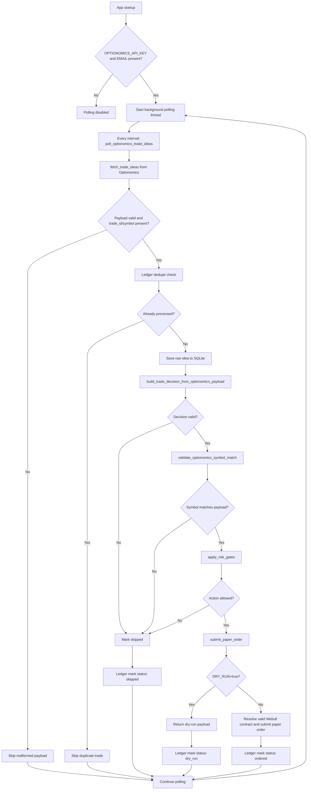
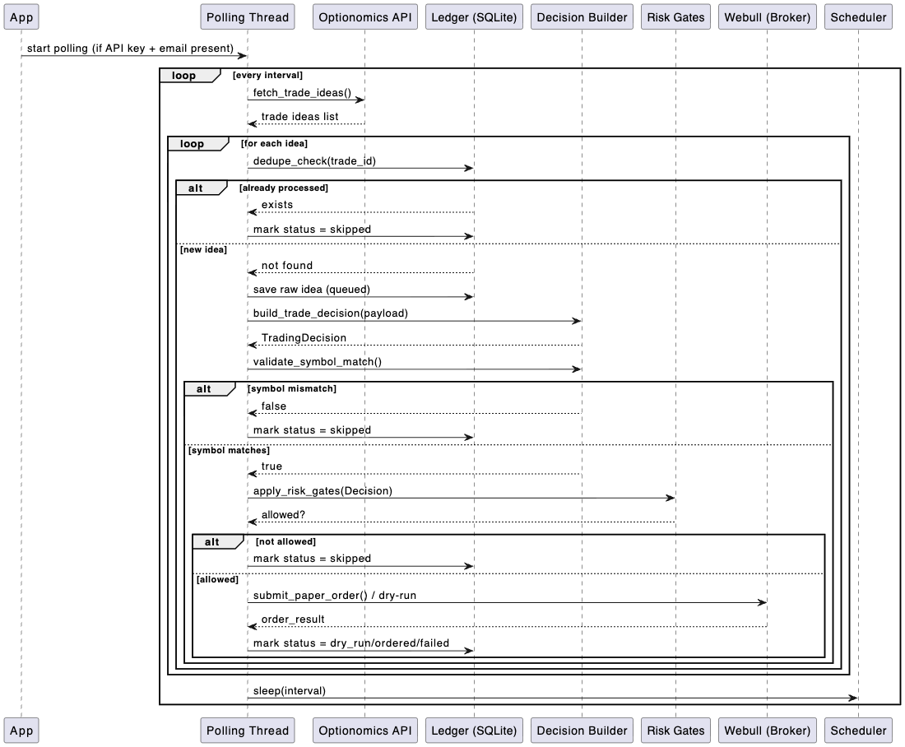

# Ops Paper Trade

This project is a paper-trading automation loop that consumes Optionomics trade ideas, validates them against a deterministic risk model, and then prepares or submits a paper order through Webull. It is designed to run as a polling service rather than an external listener.

The core entry point is [app/main.py](app/main.py). It manages configuration, fetches trade ideas, performs decision logic, stores state in SQLite, and starts the polling background worker.

## What this project does

- polls the Optionomics trade-idea API on a timer
- validates and normalizes incoming trade-idea payloads
- chooses a trading action such as buy, sell short, or skip
- enforces risk gates like symbol consistency, price-level sanity, and max notional caps
- deduplicates by trade ID to avoid repeat submissions
- resolves a valid Webull option contract from the option chain
- submits either a dry-run result or a paper order through Webull
- writes execution and decision state into SQLite for later inspection

## Architecture

The app is intentionally simple and layered around a few core pieces:

- [app/optionomics_client.py](app/optionomics_client.py): fetches trade ideas from the Optionomics API
- [app/main.py](app/main.py): orchestrates validation, risk gates, execution, and startup logic
- [app/webull-buy-combo-stock.py](app/webull-buy-combo-stock.py): stock bracket order submission used by the polling service
- [app/webull-buy-combo-option.py](app/webull-buy-combo-option.py): option bracket order submission used by `app/main-option.py`
- [app/webull_broker.py](app/webull_broker.py): shared sandbox client, account lookup, and order IDs
- [app/webull-option-chain.py](app/webull-option-chain.py): option-chain lookup utilities
- [bot.sqlite3](bot.sqlite3): local SQLite ledger used for dedupe and auditing
- [tests/test_apply_risk_gates.py](tests/test_apply_risk_gates.py): regression tests for the decision/risk logic

## Prerequisites

- Python 3.12+
- [uv](https://docs.astral.sh/uv/) for dependency management
- an Optionomics account with API access and a valid email + API token
- a Webull paper/sandbox account with API credentials
- optionally, a local `.env` file for runtime values

## Environment setup

Create a `.env` file in the project root:

```env
DRY_RUN=true
MAX_NOTIONAL_USD=250
ALLOW_SHORT_SELLING=false
FORCE_REPROCESS=false

OPTIONOMICS_API_KEY=your-optionomics-api-key
OPTIONOMICS_EMAIL=you@example.com
OPTIONOMICS_API_URL=https://optionomics.ai/api/v1/trade_ideas
OPTIONOMICS_POLL_ENABLED=true
OPTIONOMICS_POLL_INTERVAL_SECONDS=600

WEBULL_APP_KEY=your-webull-app-key
WEBULL_APP_SECRET=your-webull-app-secret
WEBULL_ENDPOINT=api.sandbox.webull.com

DATABASE_PATH=bot.sqlite3
```

## Run locally

```bash
uv sync
PYTHONPATH=. uv run fastapi dev app/main.py
```

Or run the application directly with the repo on the Python path:

```bash
PYTHONPATH=. python app/main.py
```

Health check:

```bash
curl http://127.0.0.1:8000/health
```

## How main.py works

The runtime flow in [app/main.py](app/main.py) is split into a few clear stages.

### 1. Configuration and environment loading

`Settings` is a `BaseSettings` model that reads environment variables from `.env` and from the process environment. It includes:

- broker and polling settings
- Optionomics credentials and polling controls
- Webull credentials and endpoint
- database path
- risk controls such as `MAX_NOTIONAL_USD`, `ALLOW_SHORT_SELLING`, and `FORCE_REPROCESS`

This lets the app keep runtime settings centralized instead of hardcoding values in the code.

### 2. Data models for valid payloads and trading decisions

The file defines strict models:

- `TradeIdea`: a normalized incoming trade idea from the external feed
- `TradingDecision`: the internal action the bot decides to take
- `OptionomicsTradeIdea`: normalized Optionomics payload used for signal processing

These models enforce common rules such as:

- symbol normalization to uppercase
- direction restrictions like bullish, bearish, or neutral
- level validation for price inputs
- a consistent structure for downstream processing

### 3. Option chain helpers

The app contains helper functions that flatten raw option-chain responses and pick the nearest valid contract:

- `_flatten_option_chain()`
- `select_valid_webull_option_contract()`
- `fetch_webull_option_chain()`

This is important because Webull option contracts are not always returned in a perfectly clean shape. The selector prefers exact matches by expiration and strike, and then falls back to the nearest valid expiration and strike when necessary.

### 4. Polling loop

At app startup, `@app.on_event("startup")` checks whether polling should run:

- `OPTIONOMICS_API_KEY` and `OPTIONOMICS_EMAIL` are present
- `OPTIONOMICS_POLL_ENABLED` is true

If enabled, it launches a daemon thread that loops forever:

```python
while True:
    poll_optionomics_trade_ideas()
    time.sleep(interval_seconds)
```

This means the app does not wait for an external listener; it actively pulls trade ideas on a timer.

### 5. Polling process: from API to decision

`poll_optionomics_trade_ideas()` pulls trade ideas from the Optionomics client and processes each returned item.

For each idea, it does the following:

1. reads `trade_id` and `symbol`
2. checks deduplication in SQLite
3. saves the raw idea to the ledger as queued
4. builds a `TradingDecision` with `build_trade_decision_from_optionomics_payload()`
5. skips invalid or disallowed signals
6. validates symbol matching between payload and decision
7. submits a paper order if the decision passes all gates
8. writes the final status back to SQLite

If the app is in `DRY_RUN=true`, the actual broker call is replaced by a dry-run result object, but the logic still runs end to end.

### 6. Risk gates and decision logic

`build_trade_decision_from_optionomics_payload()` decides whether a trade idea should be:

- `buy`
- `sell_short`
- `skip`

It validates directional logic such as:

- bullish trades need `target > entry` and `stop < entry`
- bearish trades need `target < entry` and `stop > entry`
- neutral trades may be treated as an iron-condor style play depending on the pipeline

Then `apply_risk_gates()` applies the final deterministic guards:

- symbol must match
- risk action must be consistent with signal direction
- required price levels must be present
- notional must be positive and capped by `MAX_NOTIONAL_USD`
- shorting is blocked when `ALLOW_SHORT_SELLING=false`

### 7. Order submission flow

`submit_paper_order()` is the broker-facing step.

It:

- creates a client order ID
- exits early in dry-run mode
- resolves a reference price from the payload
- selects an option expiration and strike using the Webull chain
- calls the Webull helper module to place the option order
- returns a response payload with metadata for the ledger

This is where the app turns a validated idea into a real paper-trading action.

### 8. Ledger and deduplication

The `Ledger` class manages SQLite tables:

- `events`: stores processed feed events and their decision/order state
- `optionomics_trade_ideas`: stores each Trade Idea and its final status

It deduplicates by `trade_id`, which prevents the same idea from being submitted repeatedly. Every trade idea gets a status such as:

- `queued`
- `skipped`
- `dry_run`
- `ordered`
- `failed`

### 9. Health endpoint

The FastAPI app exposes a simple readiness route:

```python
@app.get("/health")
def health() -> dict[str, Any]:
```

This returns a minimal status payload indicating the app is alive and whether dry-run mode is enabled.

## Data flow summary

The end-to-end path looks like this:



This flow mirrors the current logic in [app/main.py](app/main.py): fetch, dedupe, normalize, validate, risk-gate, and then either dry-run or submit.



## Development commands

```bash
PYTHONPATH=. uv run pytest -q
PYTHONPATH=. uv run pytest -q tests/test_apply_risk_gates.py
PYTHONPATH=. uv run python -m compileall app
```

## Notes and safety considerations

- This is a paper-trading project. It is not a full production trade system.
- `DRY_RUN=true` is the safest default for testing and validation.
- Webull option orders are not plain equity market orders; they require a valid option contract and priced entry logic.
- The app is deterministic and rule-based, which helps make behavior easy to inspect in SQLite and logs.
- This project is for educational and research use and is not financial advice.

## Useful queries

```bash
sqlite3 bot.sqlite3 "SELECT trade_id, symbol, status, decision_json FROM optionomics_trade_ideas ORDER BY created_at DESC LIMIT 20;"

sql query
SELECT trade_id, symbol, status, decision_json FROM optionomics_trade_ideas ORDER BY created_at DESC LIMIT 20;
```

```bash
sqlite3 bot.sqlite3 ".schema optionomics_trade_ideas"
```
