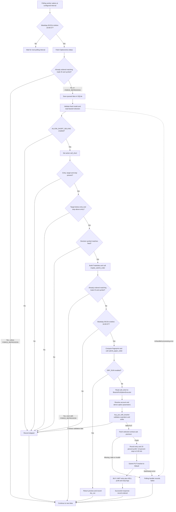

# Bearish direction and execution flow

Exit percentages are configurable with `BEARISH_PROFIT_PERCENT` and
`BEARISH_STOP_LOSS_PERCENT` in `.env`. Percentages shown below are defaults;
restart services after editing. Existing orders are unchanged.

This documents the current `app/main.py` polling path, verified from source on
2026-09-16. Direction comes from the Optionomics feed; the application does not
calculate a bearish signal from market prices.

## Decision logic

In [app/optionomics.py](app/optionomics.py),
`build_trade_decision_from_optionomics_payload` handles `direction == "bearish"`:

- If `ALLOW_SHORT_SELLING=false` (the default), skip the idea.
- If enabled, set the internal action to `sell_short`.
- Require all three feed levels: entry, target, and stop.
- Validate the bearish levels using `validate_optionomics_directional_levels`:

```python
if direction == "bearish":
    return target < entry and stop > entry
```

For example, entry 100, target 90, and stop 105 pass. Equal target/entry or
stop/entry values fail. Invalid or missing levels produce a skipped decision.
The decision uses `MAX_NOTIONAL_USD` and normalized confidence. The pipeline
label is `iron_condor` for Crush and `placeholder` otherwise; bearish execution
is routed by action, regardless of that label.

[app/main.py](app/main.py)'s `build_trade_decision` has a separate bearish branch
with equivalent direction and level checks. The polling path uses the Optionomics
builder through its compatibility wrapper.

## End-to-end flow



Unhandled exceptions elsewhere in per-idea processing also reach the polling
handler and mark the idea failed. Feed-fetch `RuntimeError` ends that scan.
The worker starts only when polling is enabled and feed credentials are present.
When both trade ID and symbol are supplied, deduplication requires both to match
an `ordered` row; it is not a permanent symbol-only exclusion.

## PUT bracket construction

[app/webull_submitter.py](app/webull_submitter.py) routes `sell_short` to
[BearishPutOptionExecutor](app/bearish_option_executor.py), which calls
`buy_put_with_bracket` in
[app/webull-buy-combo-option.py](app/webull-buy-combo-option.py).

| Parameter | Current implementation |
| --- | --- |
| Reference level | First truthy payload entry, target, or stop; otherwise `max(notional_usd / 100, 1)` |
| Requested expiration | Current UTC date plus five calendar days |
| Requested strike | `round(reference_level / 5) * 5` |
| Entry premium | Selected PUT contract snapshot ask, rounded to a 0.05 tick; no estimated-premium fallback |
| Contract selection | Requested expiration if available, otherwise earliest returned expiration; closest available strike |
| Quantity | One contract |
| Entry | PUT `BUY`, `BUY_TO_OPEN`, LIMIT, DAY |
| Take profit | PUT SELL LIMIT at entry premium plus 20% |
| Stop loss | PUT SELL STOP_LOSS at entry premium minus 10% |
| Price rounding | Entry and exit premiums rounded to a 0.05 tick |
| Exit duration | DAY by default |

The feed target and stop validate the underlying bearish setup. The submitted
exit prices are calculated separately from the option entry premium. Contract
selection adjusts the expiration/strike before fetching the premium. The quote must
match the selected contract, have a positive finite ask, and have `quote_time`
within the last 60 seconds (at most five seconds in the future). Missing or
invalid quotes prevent submission and the polling handler records failure.

The entry remains a LIMIT order at the quoted ask, rounded to the existing 0.05
tick. Exits use that rounded entry limit, not the actual fill price. For example,
a 2.00 entry limit gives a 2.40 profit limit and a 1.80 stop. Tick rounding can
change the exact percentages; collapsed or invalid brackets are rejected.
Webull’s [US options API documentation](https://developer.webull.com/apis/docs/trade-api/options/)
states that MARKET option orders are unsupported. Snapshot access and sandbox
response fields still require live validation; these changes were tested with
mocked data and broker clients. Dry runs still return before quote retrieval.

## Implementation limits and naming discrepancies

- `sell_short`, the short-selling setting, and returned `side: SELL` metadata
  describe the internal routing. The actual entry order buys a PUT; it does not
  short stock. The executor's strategy label is `sell_next_way`.
- The market-hours check applies before dry-run handling too. It checks weekdays
  and clock time, without exchange holiday or early-close handling.
- `apply_risk_gates` is not called by this polling/submission path. Quantity is
  fixed at one contract rather than sized to the decision's notional budget.
- The PUT contract lookup filters for `option_type: PUT` before selecting
  expiration and strike. Missing contract type or unavailable PUTs fail validation.
- This bearish branch returns before the stock scheduling path. It does not
  register a next-day stock exit job or reconcile option fills and exits.
- `ordered` records successful submission handling, not a confirmed fill or a
  completed bracket exit. This document is source verification, not a live broker
  execution test.

Related regression coverage lives in
[tests/test_apply_risk_gates.py](tests/test_apply_risk_gates.py), including bearish
level validation, PUT builder selection, and submission routing.

## Account selection

`OPTIONS_MARGIN_ACCOUNT_NUMBER` in `.env` selects the shared individual margin
account for bearish PUT and iron-condor submissions. The broker account list
must contain exactly one matching account number with a valid API account ID;
missing configuration or unmatched/ambiguous accounts stop submission. No
first-account fallback is used. Restart services after changing this setting.
The account type and permissions have not been verified with a live lookup.

This is the same shared `get_account_id(account_number=...)` lookup used by
`main-top-bullish.py`, which reads `TOP_BULLISH_ACCOUNT_NUMBER`. Setting both
variables to the same value routes these strategies to the same account.
The local values matched when checked on 2026-09-16; no live lookup was made.
See [the account comparison](README.md#strategy-account-selection) for the
separate main-service bullish/CALL paths and restart requirements.
