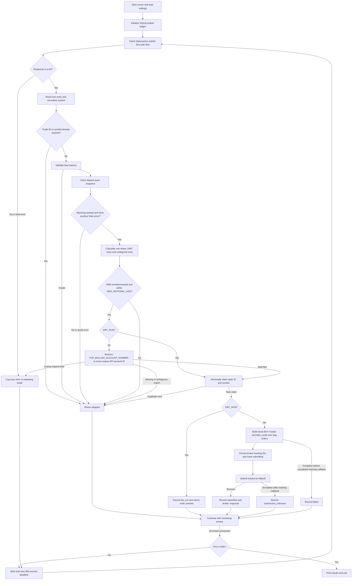

# Bullish flow stock runner

Source-verified on 2026-09-16. This document covers
[app/main-top-bullish.py](app/main-top-bullish.py), the dedicated bullish-flow
runner. It reads Optionomics bullish flow and buys **one share of stock** with
a profit/stop bracket. It does not buy a CALL option.

## Startup and scheduling

Run from the repository root:

```bash
# Broker-free order preview; still fetches real feed and stock quotes.
# Use a separate database because dry runs permanently claim symbols.
DRY_RUN=true DATABASE_PATH=/tmp/bullish-preview.sqlite3 uv run python app/main-top-bullish.py --once --limit 10
```

Without `--once`, the CLI scans immediately and every 300 seconds until Ctrl+C.
`--limit` defaults to 10 and must be positive. Scans do not overlap; missed
intervals are skipped. A scan exception is logged and the loop continues at the
next interval. Cycle logs include status counts and the next scheduled time.

This is a separate process from the FastAPI `main.py` service. Its interval is
not controlled by `OPTIONOMICS_POLL_INTERVAL_SECONDS`, and
`OPTIONOMICS_POLL_ENABLED` does not disable this runner. The feed-only
`app/top-bullish.py` fetches once and does not submit orders.

**The current runner has no market-hours gate.** It can fetch and attempt orders
outside regular sessions. Quote freshness checks still apply. The earlier
exchange-calendar checks are absent from source; related bullish tests remain
failing, as recorded in `MEMORY.md`.

## End-to-end flow



In `--once` mode, a scan-level exception propagates rather than entering a retry
loop. Per-entry `ValueError`, `TypeError` and `KeyError` become skipped results.
An unexpected scan-level error can leave later entries unprocessed until the
next scan.

## Input and quote validation

`TopBullish` calls `/api/v1/flow/bullish`, using `OPTIONOMICS_EMAIL` and
`OPTIONOMICS_API_KEY`. The runner expects a list of entries with `symbol`,
`total_premium` and `trade_count`. It validates the normalized ticker, finite
nonnegative premium, and nonnegative integer count. The count rejects booleans;
`total_premium` currently uses float coercion, which accepts booleans.

The trade identifier is `trade_id`, then `id`, then `bullish:SYMBOL`. Feed
aggregate premium is metadata, not the price used to purchase stock. No local
bullish signal or additional premium-ranking threshold is calculated.

[app/webull_quotes.py](app/webull_quotes.py) queries the Webull stock snapshot.
It requires exactly one matching symbol, a positive finite price and a valid
`last_trade_time`. Trades older than five minutes or over five seconds in the
future are rejected. This is the snapshot's last trade price, not the current
ask. A LIMIT at that price may not fill.

## Account selection

Configure `TOP_BULLISH_ACCOUNT_NUMBER` in `.env` with the intended sandbox account
number. Before claiming a non-dry-run symbol, the runner trims this value and
calls the stock helper's `get_account_id(account_number=...)`, which is the
shared function in [app/webull_broker.py](app/webull_broker.py).

The broker list must contain exactly one matching `account_number` with a valid
API `account_id`. Missing configuration, missing matches or ambiguous matches
prevent submission. There is no first-account fallback for this runner.
Dry runs do not resolve an account or submit an order.

Bearish PUT and iron-condor execution use the same lookup function, but read
`OPTIONS_MARGIN_ACCOUNT_NUMBER`. Set both variables to the same account number
to share an account across these three paths. The local settings matched when
checked on 2026-09-16; account type and permissions were not live-verified.
Actual identifiers are intentionally excluded from this document.

This differs from the main service's separate bullish stock path and
`main-option.py`'s CALL path, which still select the first returned account.
See [the account comparison](README.md#strategy-account-selection).

## Configurable entry and exits

```dotenv
DRY_RUN=true
MAX_NOTIONAL_USD=250
BULLISH_PROFIT_PERCENT=10
BULLISH_STOP_LOSS_PERCENT=5
# Fill in privately before non-dry-run submission:
TOP_BULLISH_ACCOUNT_NUMBER=
```

The account and percentage settings are loaded from the project `.env` or
process environment; process environment takes precedence. Restart the runner
after changing them. Existing broker orders are not modified.

```text
entry = stock snapshot price, rounded to two decimals
profit target = entry × (1 + BULLISH_PROFIT_PERCENT / 100)
stop price = entry × (1 - BULLISH_STOP_LOSS_PERCENT / 100)
```

Target and stop are also rounded to two decimals. Both percentages must be
positive and finite, and stop-loss percentage must be less than 100. The final
prices must satisfy `0 < stop < entry < target`. With the default percentages,
a 100.00 entry gives a 110.00 target and a 95.00 stop.

| Order | Side | Type | Quantity | Duration |
| --- | --- | --- | --- | --- |
| MASTER | BUY | LIMIT at entry | One share | DAY |
| STOP_PROFIT | SELL | LIMIT at target | One share | DAY |
| STOP_LOSS | SELL | STOP_LOSS at stop | One share | DAY |

The one-share entry cost must not exceed `MAX_NOTIONAL_USD`. The runner does not
increase quantity to spend the remaining budget. Exits are calculated from the
entry limit, not adjusted after actual fills. Stop execution price is not
guaranteed. This runner does not register next-day stock exit jobs; setting
`NEXT_DAY_EXIT_ENABLED` does not add scheduled exits to these orders.

## Ledger, duplicate protection and failures

[app/bullish_ledger.py](app/bullish_ledger.py) stores rows in
`top_bullish_trades` within `DATABASE_PATH` (default `bot.sqlite3`). Trade ID is
unique and symbol is independently unique, case-insensitively. An atomic claim
precedes order submission, after validation, quote retrieval and live account
selection. The broker callback saves entry/profit/stop tracking IDs before
sending the request.

| Status | Meaning |
| --- | --- |
| queued | Trade ID and symbol claimed |
| dry_run | Preview saved without order submission |
| submitting | Tracking IDs persisted before the broker request |
| submitted | Broker helper returned successfully; not proof of a fill |
| failed | Exception before tracking callback completed |
| submission_unknown | Exception after tracking callback; acceptance may be unresolved |

All claimed statuses permanently block another attempt for the same trade ID
**or symbol**, including dry runs and failures. Quote/budget skips before a
claim remain retryable. Changing the account does not reset these claims.
A restart does not automatically reconcile pending or unknown submissions;
inspect saved tracking IDs against the broker before taking further action.

This table does not deduplicate against other strategy tables or check existing
broker positions. Sharing an account therefore does not provide cross-strategy
position exclusion. The runner records submission observations, not live fill
or exit reconciliation. DAY bracket exits do not provide next-session coverage.

## Source and verification

- [app/main-top-bullish.py](app/main-top-bullish.py): orchestration and scheduling.
- [app/top-bullish.py](app/top-bullish.py): bullish feed retrieval.
- [app/strategy_settings.py](app/strategy_settings.py): configurable percentages.
- [app/webull-buy-combo-stock.py](app/webull-buy-combo-stock.py): broker bracket.
- [tests/test_strategy_settings.py](tests/test_strategy_settings.py): custom
  bullish percentages in order construction and settings validation.
- [tests/test_top_bullish.py](tests/test_top_bullish.py): runner coverage, including
  the previously recorded failing market-hours interface tests.

This document was checked against source. No service was started, settings were
changed, or broker orders placed while writing it. Sandbox quote access and
broker bracket behavior still require live validation.
