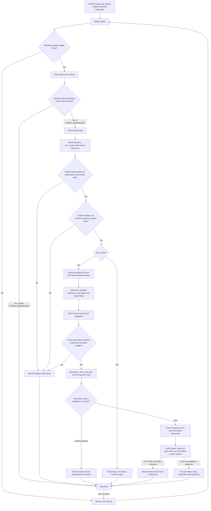

# Neutral ideas and iron-condor flow

Updated 2026-09-16. **Valid neutral Optionomics ideas now reach the Webull paper
iron-condor submitter from `app/main.py`.** The former unconditional neutral skip
has been removed. `main-option.py` also delegates neutral submission to this
shared path instead of sending a CALL bracket.

## Decision and execution conditions

Start the FastAPI application, for example:

```bash
uv run fastapi dev app/main.py
```

Polling requires `OPTIONOMICS_POLL_ENABLED=true` and the feed credentials. The
worker and submission handler check weekdays from 09:30 to before 16:00 Eastern;
this existing clock check does not account for holidays or early closes.

The Optionomics builder selects `strategy="iron_condor"` for neutral ideas,
regardless of pipeline. Its internal action remains `buy` for compatibility;
actual broker entry is a SELL credit combo. Entry, target and stop must be
positive, finite and satisfy `target < entry < stop`. These feed levels validate
the setup; they are not the option exit premiums.

`ALLOW_SHORT_SELLING` controls bearish decisions, not this defined-risk neutral
strategy. `DRY_RUN=true` returns a decision preview before any contract, quote or
broker access. `DRY_RUN=false` enables sandbox submission after the checks below.
No environment settings were changed during implementation.

## End-to-end flow



Contract/quote validation failures also skip. Other exceptions reach the polling
failure handler. The second ordered check is not bypassed by `FORCE_REPROCESS`.
The submission reservation is never bypassed by that setting either.

## Contract selection and premium pricing

The executor queries listed contracts from the requested expiry (UTC today plus
30 days) through the following 14 days. It handles pagination and selects the
first returned expiry that supports the requested shape. It requires a reported
100 multiplier and a standard OCC symbol matching the underlying, expiry, type
and strike. Missing required metadata, adjusted roots and unusable contracts
are rejected. Live sandbox response compatibility remains unverified.

Default desired width is `max(1, reference * 0.05)`, with reference taken from the
feed entry. Inner strikes are selected near `reference ± width`, with the put
below reference and call above it. The outer strikes provide equal positive
wing widths, selected as close as possible to the desired width. All four
contracts must share an expiry and have distinct ordered strikes.

All four quotes are requested together. Each must match the selected contract,
have a positive bid and ask with `bid <= ask`, and a `quote_time` no older than
60 seconds and no more than five seconds ahead of the validation clock.

```text
entry credit = short put bid + short call bid - long put ask - long call ask
maximum spread loss = (wing width - entry credit) × 100 × quantity
```

Entry credit rounds down to a 0.05 tick and must be positive and less than wing
width. Quantity is one combo (one contract per leg). Maximum spread loss must
not exceed the smaller of the decision budget and `MAX_NOTIONAL_USD`. This
calculation excludes fees and assumes the spread remains intact; it is not a
broker margin quote or protection against assignment-related stock exposure.
The executor skips an over-budget selection rather than searching narrower wings.

## Entry and exits

| Order | Overall side | Type | Price | Duration |
| --- | --- | --- | --- | --- |
| MASTER | SELL, SELL_TO_OPEN | LIMIT | Net entry credit | DAY |
| STOP_PROFIT | BUY | LIMIT | Entry credit × 0.90 | GTC |
| STOP_LOSS | BUY | STOP_LOSS | Entry credit × 1.05 | GTC |

Both exits reverse **all four legs**, with matching quantities, strikes and
expiry. Position intent is specified only on the master, consistent with the
[Webull combo-order field restriction](https://developer.webull.com/apis/docs/reference/order-detail/).
Webull documents [iron-condor LIMIT orders and option combo types](https://developer.webull.com/apis/docs/trade-api/options/).
Specific sandbox acceptance of this three-order bracket has not been exercised.

Profit remains **10%** and stop remains **5%** for iron condors. The bearish PUT
strategy's 20%/10% settings are separate. Prices round to a 0.05 tick; if rounding
collapses the target, entry and stop ordering, the executor skips the setup.

For a reference of 100, a five-point wing and the listed strikes below:

| Contract | Entry leg | Both exit legs |
| --- | --- | --- |
| 90 PUT | BUY | SELL |
| 95 PUT | SELL | BUY |
| 105 CALL | SELL | BUY |
| 110 CALL | BUY | SELL |

A 3.00 entry credit sets a 2.70 profit debit and 3.15 stop debit. The maximum
spread loss for one combo is 200 dollars before fees. Exits are based on the
entry limit credit, not the eventual fill; price improvement and rounding can
change realized percentages. A stop trigger does not guarantee its execution
price.

## Persistence and retries

The normal `optionomics_trade_ideas` row records the decision and final status.
Before the broker call, an atomic `events` reservation under
`iron-condor:<fingerprint>` persists the full prepared request and tracking IDs.
The fingerprint is stable for a polling trade ID. The event moves from queued
to submitting, then ordered or failed. No extra database table is required.

Any existing reservation blocks another submission for that fingerprint,
including failures, timeouts and a crash before the request was sent. This
conservative behavior prevents blind replays. It does not reconcile orders
automatically: inspect the saved combo/entry/profit/stop IDs against Webull before
considering a retry. Do not delete reservations merely to rerun a failed scan.
Pre-submission validation skips and dry runs do not create reservations.

A different trade ID can create another position; this is not portfolio-wide
position exclusion. Successful submission status does not prove a fill or
completed exit. The stock next-day exit scheduler does not manage this strategy.

## Source and verification

- [app/optionomics.py](app/optionomics.py): neutral decision and level validation.
- [app/main.py](app/main.py): polling, market-hours check, deduplication and status.
- [app/webull_submitter.py](app/webull_submitter.py): routing and durable reservation.
- [app/iron_condor_option_executor.py](app/iron_condor_option_executor.py): contracts,
  quotes, risk calculation and complete bracket construction.
- [tests/test_iron_condor.py](tests/test_iron_condor.py): mocked end-to-end polling,
  four-leg reversals, pricing, risk limits, invalid data and timeout/replay checks.

No broker orders were placed during implementation. Account permissions, market
data availability, actual response fields and bracket acceptance still require
sandbox validation. The full test suite also has previously recorded failures
in the separate bullish runner's market-hours interface.
